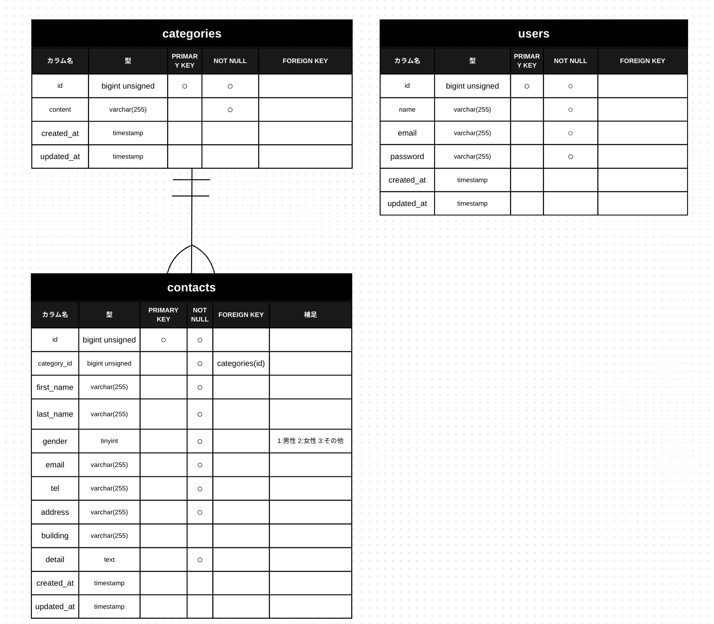

✅ これをREADME.mdにコピペ（完全版）
# お問い合わせフォーム（Contact Form）

## 環境構築

### Dockerビルド

```bash
git clone git@github.com:kouki014129/contact-form-submit.git
cd contact-form-submit
docker compose up -d --build
```
※ ポートが他のコンテナと競合して起動できない場合は、`docker compose down` で他プロジェクトを停止してから再実行してください。

### Laravel環境構築
```bash
docker compose exec php bash
composer install
cp .env.example .env
php artisan key:generate
php artisan migrate
php artisan db:seed
```

### 開発環境
- お問い合わせ画面：http://localhost:84
- ユーザー登録：http://localhost:84/register
- ログイン画面: http://localhost:84/login
- phpMyAdmin：http://localhost:8084

### 使用技術（実行環境）

- PHP PHP 8.1.34
- Laravel 8.83.29
- MySQL 8.0.26
- nginx 1.21.1
- Docker / docker compose

### ER図

